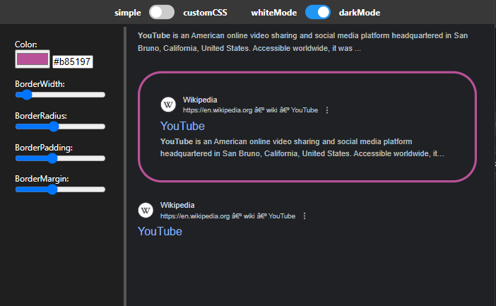

# GoogleArrowNavigation
GoogleArrowNavigation is a browser extension for the google search website. You can navigate through search results via arrow keys

# Design
The design of the selected search result is customizable in 2 modes: simple and custom. You can customize in the extension UI via clicking on the extension icon

# Troubleshooting
The extension should be working with all search sites of google, nevertheless if your site is not working please use one of the domains:

https://www.google.com/supported_domains