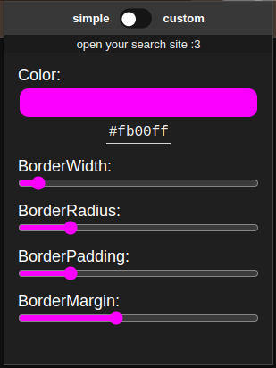
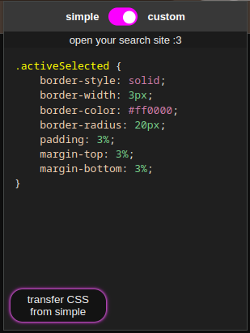

# ArrowKeys For Search
**ArrowKeys For Search** is a browser extension for various search engines. \
While searching on the web, you can navigate through the corresponding search results convenient via the arrow keys. It's also possible to return to the searchbar via those keys and with `Enter` a result can be *'clicked'*, if selected.

## supported search engines
- Google
- Startpage
- Qwant
- DuckDuckGo
- Ecosia
- Yandex

# Install
### Firefox:
You can download the extension on:\
https://addons.mozilla.org/en-GB/firefox/addon/google-arrow-navigation/

### Chrome:
Currently it's not available in Google Web Store, but you can download it the zip [releases](https://github.com/jusnim/GoogleArrowNavigation/releases) or alternatively load it in your browser as an unpacked version
I'm looking forward to release on the Store.

# Design
The design of the selected search result is customizable in 2 modes: simple and custom.\

\

### Example

# Support

